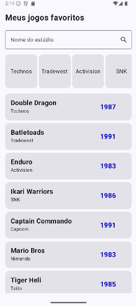
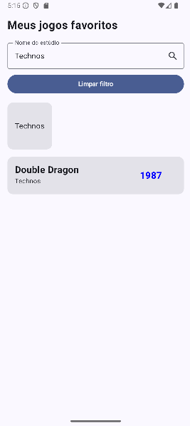
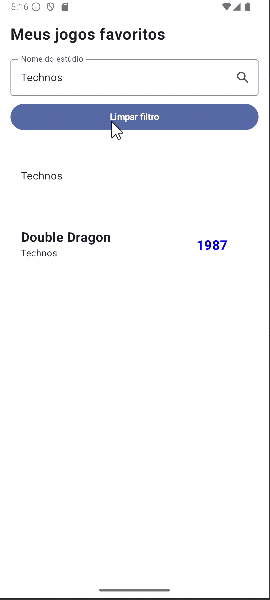

# Fundamentos Jetpack Compose - Listas Lazy

## Integrantes da equipe
- Samuel Fialho - RM: 551824
- Henrique de Mello - RM: 551273

## Funcionalidades implementadas
1. Filtro por nome do estúdio usando a caixa de texto.
2. Exibição de botão **"Limpar filtro"** quando há pesquisa ou seleção de estúdio.
3. Clique em um estúdio na `LazyRow` aplica o filtro automaticamente.
4. Botão **"Limpar filtro"** restaura a lista original.

## Telas do aplicativo
### Tela inicial (lista completa)



### Filtro aplicado



### Botão "Limpar filtro"


## Como executar
1. Clone este repositório:
   ```bash
   git clone https://github.com/samucafialho/fundamentos-jetpack-compose-listas-lazy.git
2. Abra o projeto no Android Studio.
3. Execute em um emulador ou dispositivo físico Android.
